# rarity-analyzer

OpenRarity.xyz - Open Source NFT Rarity Analysis

https://openrarity.xyz

## Features

- Website
- Discord Bot
- Serverless (Netlify)

### Website

https://openrarity.xyz

- Create React App
- Netlify Continuous Deployment from Github
- Project Themes
- Lazy Loading for Great Performance

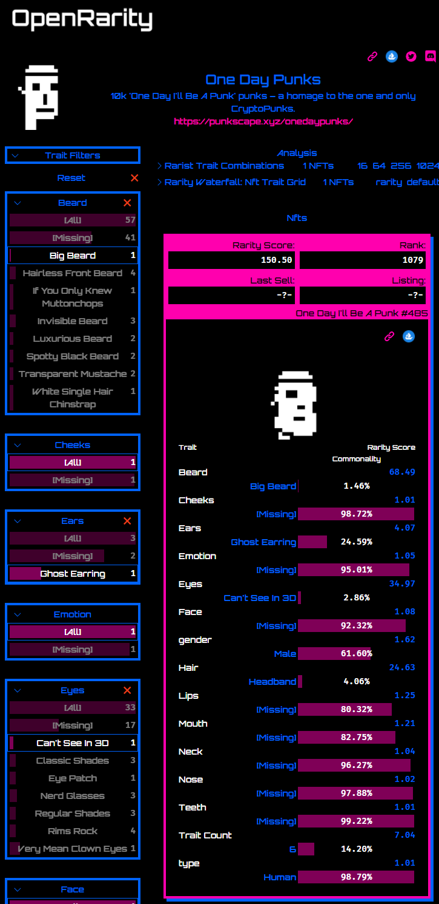

- Small Screen Support

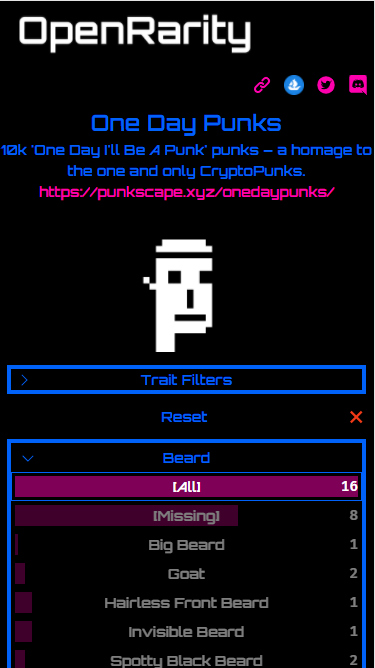

- Large Screen Support

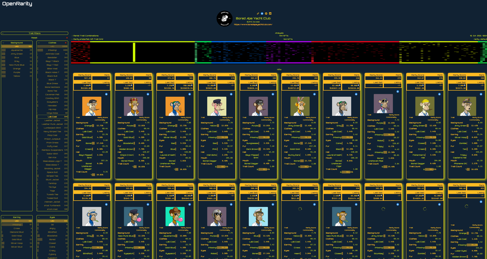

### Nft Metadata

- Analyzed with node scripts using GitHub Actions (or locally)
- Easy 1,2,3 to add a project
    - Fork GitHub Repo
    - Add 2 metadata files:
        - ./data/[project].json
        - ./data/[project].project.json
    - Submit a PR
        - Github actions will automatically build the rarity files
        - Netlify Continous Deployment will automatically generate a preview

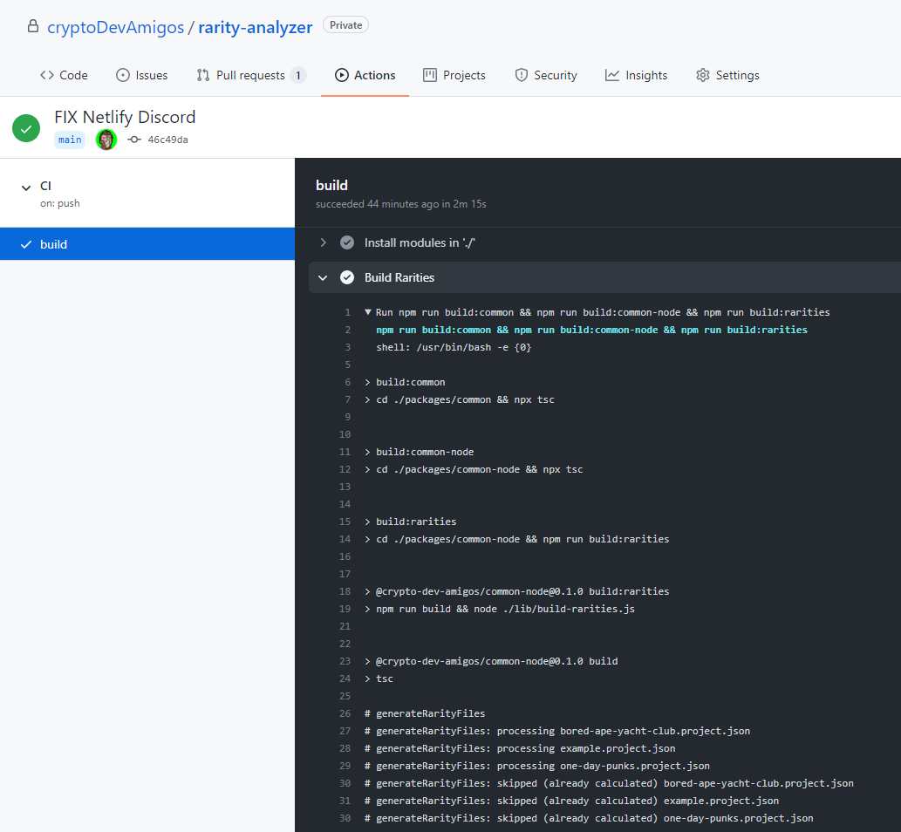

### Rarity Analysis

#### NFT Rarity Card

- Easily see Rank and Score
- OpenSea Last Sell, List Price, and Link
- NFT Preview
- Attribute Values with Integrated Bar Graph
- Quickly visualize and compare NFTs

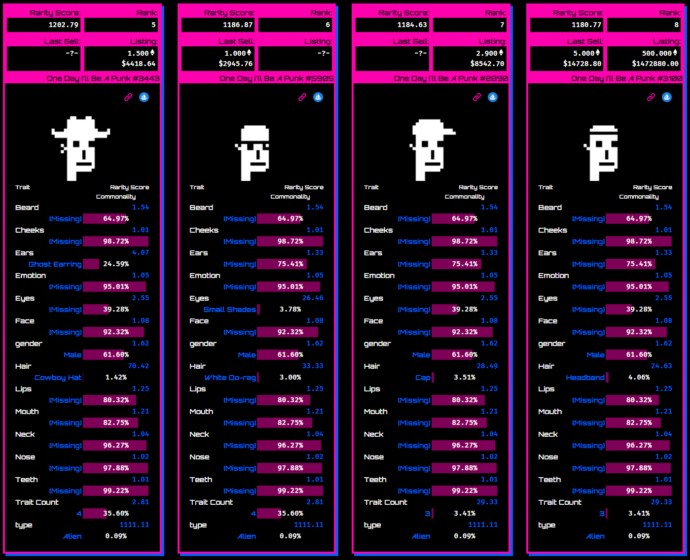

#### Trait Filters

- Visualize Trait Rarity with integrated bar graphs
- Preview the number of NFTs remaining after selecting each trait
- Drill down to specific traits

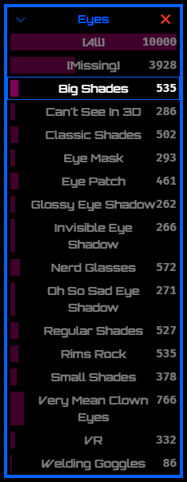

- Filter applies to all views
    - NFT Cards
    - Trait Waterfall
    - Rarist Trait Combinations

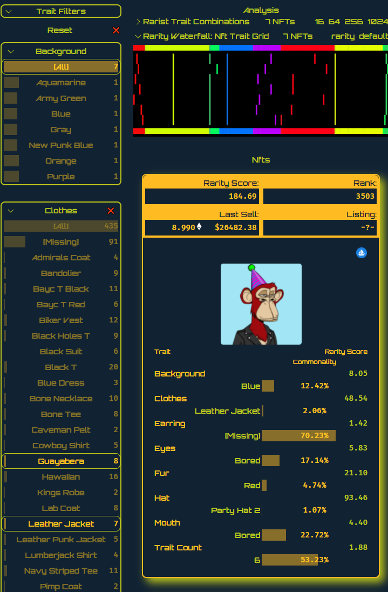

#### Trait Waterfall

- See everything in one beautiful view
- Rarist NFTs are the top rows
- Common NFTs are the bottom rows
- Traits are columns

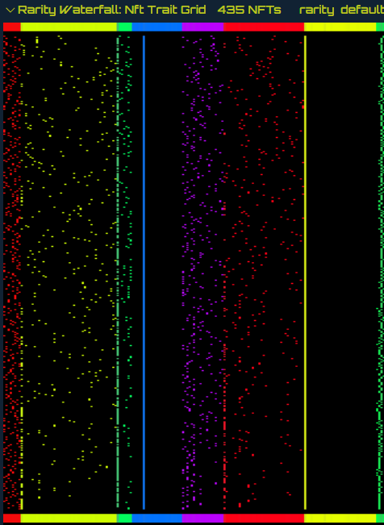

- Sort Traits by Rarity
    - Left is rare traits
    - Right is common traits

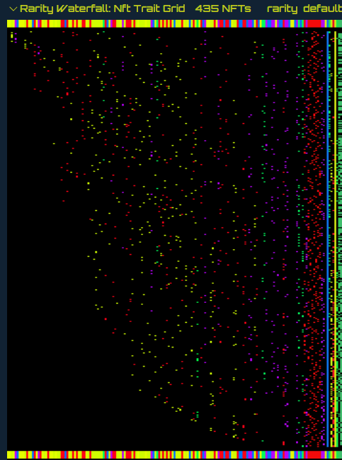

#### Rarist Trait Combinations (Sankey Diagram)

- Explore the rarist combinations of traits

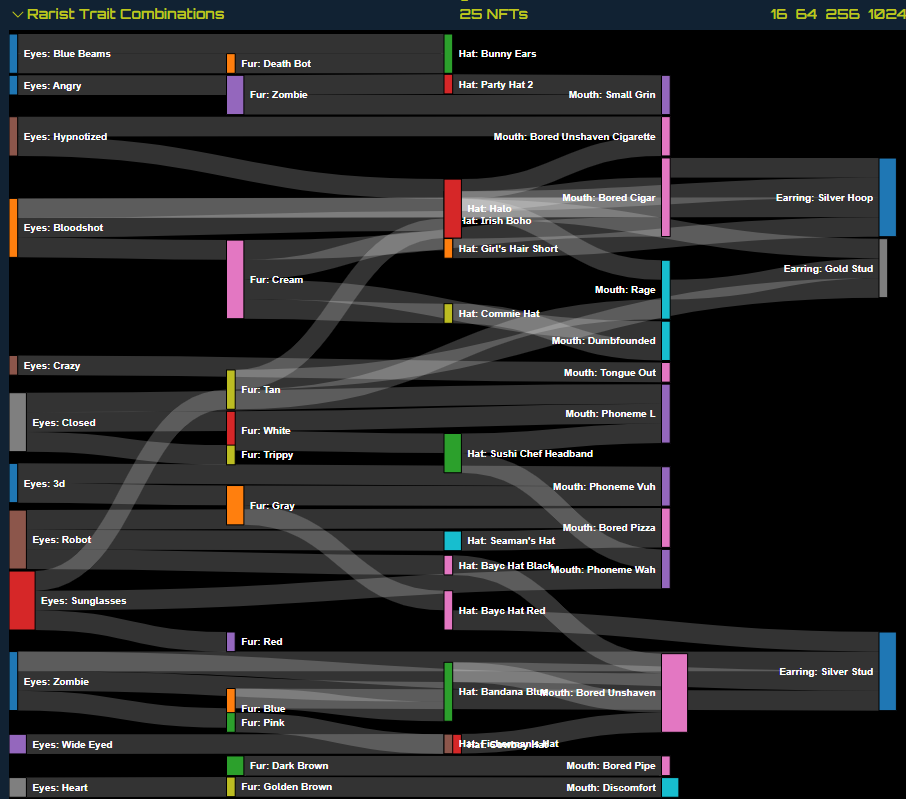

### Discord Bot

- /openrarity projects

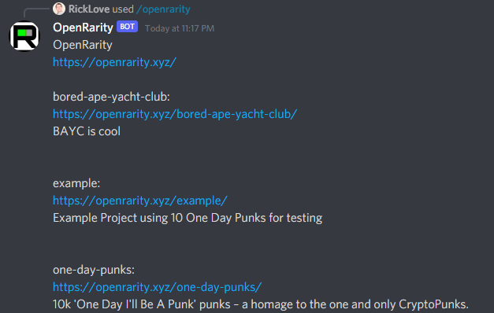

- /openrarity project project-key:one-day-punks

- /openrarity nft project-key:one-day-punks token-id:42 
    - Even has a ascii bar graph!

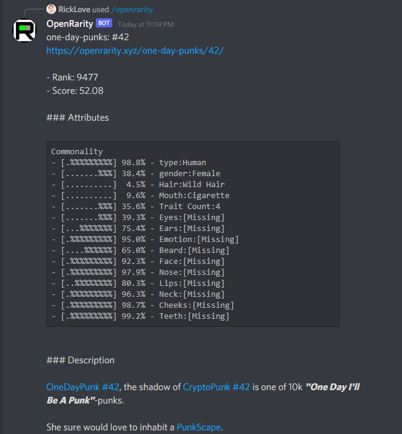

### Discord Application Commands Api

- Discord Outgoing Webhooks

    - No running server costs
    - Using Netlify Functions 
    - Continous Deployment from GitHub Repo
    
- tl;dr - free (unless you get a ton of traffic somehow)

### Clonable

- Cloning is easy
- Setup your own website with just your projects
- But also submit those to be included in OpenRarity.xyz
- GitHub PR allows you to easily submit metadata that you've added to your own fork

---

## Development

1. Requires npm version 7 (for npm workspaces).  Npm upgrade info for Windows `https://stackoverflow.com/questions/18412129/how-can-i-update-npm-on-windows`

2. Run `npm install` at the root of rarity-analyzer to install server dependencies including scope packages and workspaces.  

NOTE: you can run npm install at root to build scoped packages. 
e.g (While running packages/server/, you can make changes to packages/common/ and run npm install at root to rebuild the @crypto-dev-common package)

3. Run `npm start` to start the development server.

## Architecture

### Frontend

- load /tokenId.json files from api
- routing /projectKey/tokenId
    - /project Pages - show list of tokens
    - /token - show rarity details
        - image: imageUrl.replace('ipfs://', 'https://gateway.pinata.cloud/ipfs/')
        - external_url: [same as above]
        - rarity data:
            - trait: rarity value

### Static Pregenerated Rarity Data (using GitHub actions to pre-calculate rarity)

- Host website on Netlify (with continuous deploy from repo folder '/web/')
- GitHub actions
- root of repo: /data/nft-projects-metadata/
- To submit a new project, github PR to add a new .json to that folder
    - projectName-nfts.json
    - projectName-details.json
- Github action would process all the files in that folder and generate the rarities into a static folder structure
    - i.e.
     - /web/data/results/projectId/list.json
     - /web/data/results/projectId/0.json
     - /web/data/results/projectId/1.json
- Website would access the .json files as static content of the same domain:
    - `site.com/projectName/0` would load `site.com/data/projectName/0.json`
- Anybody can setup their own website 
    - create a netlify
    - point netlify to repo/web

### Discord Integration

- Use discord outgoing webhooks (serverless)
- Requests handled by Netlify functions (or other serverless provider like AWS lambda) 

## PRogress
### Hackathon Requirements

- [ ] https://github.com/punkscape/01-rarity-analyser-hackathon
    - [x] Only OneDayPunk owners may participate in the hackathon
        - [x] You have to hold a OneDayPunk to take part in the hackathon. 
    - [x] The app has to calculate a rarity score for each item in the given collection
    - [x] The app has to be deployed on a live server (Heroku free tier or similar is fine)
    - [x] The app has to be usable: Minimum requirement is that the rarity of each item in the collection can be queried / viewed
    - [ ] There must be easy to follow documentation for other developers on how to configure their own collection metadata and deploy it to a server.
        - [] "As a good example of an easy to install and configure package check out this open source discord bot for OpenSea sales: https://github.com/0xEssential/opensea-discord-bot"

- [x] Generate `/web/projectName/collection-rarities.json`
- [x] Json data is accessible 
- [ ] Discord integration
- [ ] Instructions
    - [ ] Add Project
    - [ ] Deploy clone
- [ ] Submission before 27.09.2021 00:00 UTC

    
### Tasks

- [x] Github action to build:rarities
- [x] Copy files from react/build to web in build script
- [x] Fix build path for common web/build
- [ ] Finish Web UI
    - List all projects
        - [x] Add `web/data/projects.json` output
        - [x] Create ProjectsComponent
    - List nfts for a project
        - [x] Add `web/data/one-day-punks/project.json` output
        - [x] Create ProjectNftsComponent
    - [x] Fix React favicons, title, etc.
    - [x] Add Project Details
        - [x] Links (Discord, Twitter, Site, etc.)
        - [x] Theme (see css vars)
        - [x] Logo
    - [ ] OpenRarity Site
        - [x] Logo (Home Button)
        - [x] Creators List (Punks)
            - [x] Name, Bio, Links
        - [ ] Feature List (of site)

- [ ] OpenRarity Discord Server + OutgoingWebhookBot
    - [x] Create Open Rarity Discord Server
    - [ ] Create Open Rarity Discord Application
        - [ ] Instructions https://discord.com/developers/applications/890947995426771015/oauth2
            - Note: using Netlify functions instead of Lambda
        - [ ] Discord Docs:
            - Received Outgoing Webhooks
                - https://discord.com/developers/docs/interactions/receiving-and-responding#receiving-an-interaction
            - Register Slash Commands
                - https://discord.com/developers/docs/interactions/application-commands#registering-a-command
        - [ ] POST Url: https://www.openrarity.com/api/v1/discord
        - [ ]
    - [ ] Handle commands
        - [ ] /openrarity list
            - List known projects
        - [ ] /openrarity project-key token-id
            - Get token rarity info for a known project-key
        - [ ] /openrarity token-id
            - Get token rarity info for a default project-key 
            - configured during command integration of discord server

- [ ] ? Easy Button: Add contract address and hit submit on website
    - [!STORAGE] 
        - This probably can't be done purely by github actions
        - Where will the data go?
    - [ ] ? Use web3 to get contract data
    - [ ] ? Use open sea api to get data

- [ ] Add Instructions for adding project
    1. Create `/data/project-name.project.json` file with ContractUri json data
    2. Create `/data/project-name.json` file with nft metadata (TokenUri json array) data
    3. Submit a pull request
        - Rarities will be calculated
        - Website will be updated with results

- [ ] Instructions for Forking and deploy to site provider (Netlify)

- [ ] Improve Git Performance
    - Remove web folder from all branches except `deploy` branch
    - Run build github action only on `deploy` branch

### Ideas

- [ ] Show owned Nfts
    - Contract Address
        - Manually enter contract address
        - Web3 to get contract address of user
    - https://docs.opensea.io/reference/getting-assets

### Other Rarity Tools

- https://rarity.tools/
- https://rarity.guide/